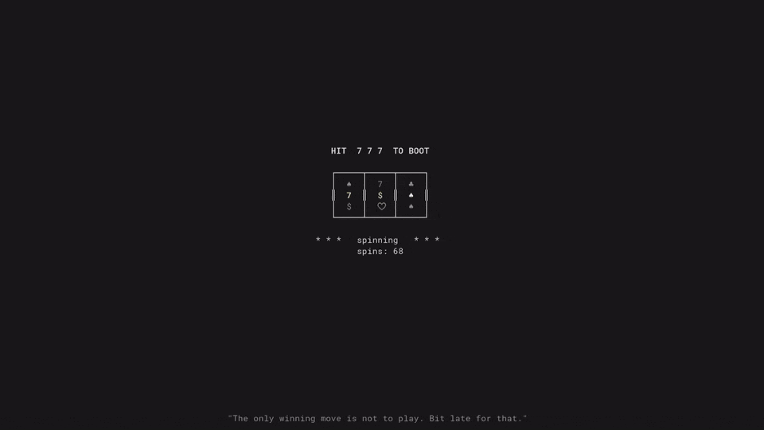

# slots-boot

[](https://github.com/Elandig/initramfs-slots-boot/actions/workflows/ci.yml)
[](https://github.com/Elandig/initramfs-slots-boot/releases)
[](LICENSE)

Your bootloader, except it's a slot machine. The boot doesn't finish until you spin
`7 7 7`.

<p align="center"></p>

Press **SPACE** to spin. Hit three sevens and it boots. It's a toy - don't put it on a
machine you actually need.

Stuck? Type **`letmeboot`** at the screen to skip the game and boot normally.

## Install

- **Arch** - `cd packaging/arch && makepkg -si`, then add `slots` to `HOOKS` in
  `/etc/mkinitcpio.conf` (after `keyboard`, before `block`) and run `sudo mkinitcpio -P`.
- **Debian / Ubuntu** - `packaging/debian/build-deb.sh && sudo dpkg -i slots-boot_*.deb`
- **Fedora** - `rpmbuild -ba packaging/fedora/slots-boot.spec`, then install the rpm.
- **Anything else** - `make static && sudo ./install.sh`

## How it works

Runs from the initramfs before the root filesystem is mounted, takes over the console,
and hands control back once you win (or type the skip word). It's a single static
binary, needs nothing from the system, and writes nothing to disk.

## Testing

```sh
cargo test                # unit tests
test/docker/run-tests.sh  # binary logic, in a container
test/qemu/run.sh          # boots a kernel in QEMU so you can play it
test/qemu/run.sh auto     # headless self-play, asserts it wins
```

## Uninstall

`sudo ./uninstall.sh`, then remove `slots` from `HOOKS` if you added it.

## License

MIT.
